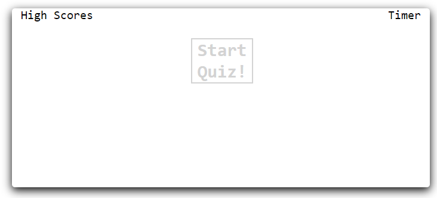
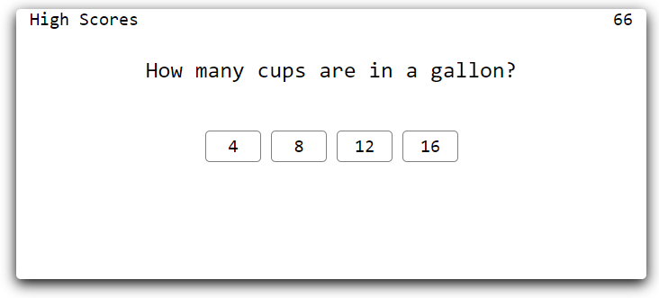
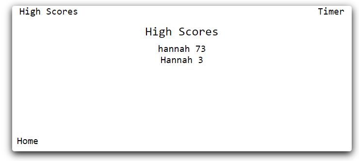

# CodeQuiz

A way to exercise JavaScript fundamentals like loops, time intervals, and local storage. Users are challenged to take a timed quiz. Developers can cutomize questions.

## Build status

Curently deployed: https://hchamorro.github.io/codeQuiz/

## Code style

JavaSript, CSS & HTML

## Screenshots

Home Page:



Question Display:



High Scores:



## Tech/framework used

<b>Built with JavaScript</b>
Ex. -
```
function renderScore() {
  nameAndScore.innerHTML = "";
  var lastUser = JSON.parse(localStorage.getItem("storage"));
  for (var i = 0; i < lastUser.length; i++) {
    var name = user[i].names;
    var score = user[i].savedScores;
    var div = document.createElement("div");
    div.textContent = name + "   " + score;
    div.setAttribute("data-index", i);
    nameAndScore.appendChild(div);
  }
  if ((lastUser = null)) {
    lastUser = user;
  }
}
```

## Installation

After cloning this repo the test should run in local browser.

## Issues
Restart Function

Clear High Scores

Sort Scores High to Low

## Contribute

Pull requests are welcome. For major changes, please open an issue first to discuss what you would like to change.

Please make sure to update tests as appropriate.


## License

MIT © [hchamorro]()
